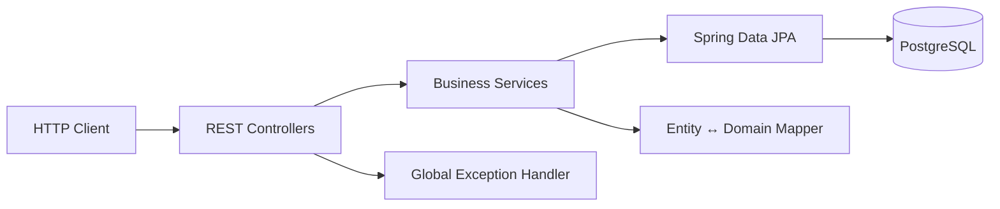

# Reservation Service

A small REST API for managing room reservations.

The project focuses on a realistic backend use case rather than a large feature set: create and update reservations, check room availability, approve reservations, cancel pending reservations, filter results, validate requests, and persist data in PostgreSQL.

[](https://www.oracle.com/java/)
[](https://spring.io/projects/spring-boot)
[](https://www.postgresql.org/)
[](https://maven.apache.org/)

## What this project demonstrates

- Building a REST API with Spring MVC
- Layered application structure: Controller → Service → Repository
- Spring Data JPA and custom JPQL queries
- Bean Validation with meaningful error responses
- Business rules for reservation state transitions and date conflicts
- Unit tests with JUnit 5, Mockito and AssertJ
- Repository/integration tests with H2
- PostgreSQL for local development
- Docker Compose for reproducible database setup
- GitHub Actions CI for automated tests

## Architecture



The application keeps business rules in the service layer and database-specific access in the repository layer. The API models are represented with Java records.

## Main business rules

### Reservation lifecycle

```text
CREATE
  ↓
PENDING
  ├── approve → APPROVED
  └── cancel  → CANCELLED
```

A pending reservation can be edited or cancelled.

An approved reservation cannot be cancelled through the current API.

An already cancelled reservation cannot be cancelled again.

Only `APPROVED` reservations block a room during availability checks. Pending reservations do not reserve the room yet.

### Date ranges

Reservations use the interval:

```text
[startDate, endDate)
```

That means two bookings can be back-to-back:

```text
Reservation A: 2026-10-10 → 2026-10-15
Reservation B: 2026-10-15 → 2026-10-20
```

They do not conflict.

## API

Base URL:

```text
http://localhost:8080
```

| Method | Endpoint | Purpose |
|---|---|---|
| `POST` | `/reservation` | Create a reservation |
| `GET` | `/reservation/{id}` | Get a reservation by id |
| `GET` | `/reservation` | Search reservations with optional filters and pagination |
| `GET` | `/reservation/status/{status}` | Get reservations by status |
| `GET` | `/reservation/room/{roomId}` | Get reservations for a room |
| `PUT` | `/reservation/{id}` | Update a pending reservation |
| `POST` | `/reservation/{id}/approve` | Approve a pending reservation |
| `DELETE` | `/reservation/{id}/cancel` | Cancel a pending reservation |
| `POST` | `/reservation/availability/check` | Check room availability |

Available statuses:

```text
PENDING
APPROVED
CANCELLED
```

## Example requests

### Create reservation

```bash
curl -X POST http://localhost:8080/reservation \
  -H "Content-Type: application/json" \
  -d '{
    "userId": 1001,
    "roomId": 42,
    "startDate": "2026-10-10",
    "endDate": "2026-10-12"
  }'
```

Example response:

```json
{
  "id": 1,
  "userId": 1001,
  "roomId": 42,
  "startDate": "2026-10-10",
  "endDate": "2026-10-12",
  "status": "PENDING"
}
```

### Check availability

```bash
curl -X POST http://localhost:8080/reservation/availability/check \
  -H "Content-Type: application/json" \
  -d '{
    "roomId": 42,
    "startDate": "2026-10-10",
    "endDate": "2026-10-12"
  }'
```

Available:

```json
{
  "message": "Room is available",
  "status": "AVAILABLE"
}
```

Reserved:

```json
{
  "message": "Room is not available",
  "status": "RESERVED"
}
```

### Approve reservation

```bash
curl -X POST http://localhost:8080/reservation/1/approve
```

Approval re-checks room availability before changing the status to `APPROVED`.

### Search with filters

```bash
curl "http://localhost:8080/reservation?userId=1001&roomId=42&pageNumber=0&pageSize=10"
```

`pageSize` is limited to `1..100`.

## Error handling

The API returns a consistent JSON structure for application errors:

```json
{
  "message": "Bad request",
  "details": "startDate must be before endDate",
  "timestamp": "2026-09-25T10:15:00"
}
```

Typical statuses:

| HTTP status | Meaning |
|---|---|
| `201 Created` | Reservation created |
| `200 OK` | Successful read/update/approval |
| `204 No Content` | Reservation cancelled |
| `400 Bad Request` | Validation or business rule violation |
| `404 Not Found` | Reservation does not exist |
| `500 Internal Server Error` | Unexpected server-side error |

## Run locally

### Prerequisites

- JDK 21
- Docker + Docker Compose

Spring Boot 4.1.1 requires Java 17+; this project targets Java 21.

### 1. Start PostgreSQL

```bash
docker compose up -d
```

The database is created with:

```text
database: reservation_service
user:     reservation_user
password: reservation_password
port:     5432
```

### 2. Run the application

Linux/macOS:

```bash
./mvnw spring-boot:run
```

Windows:

```powershell
.\mvnw.cmd spring-boot:run
```

The API is available at:

```text
http://localhost:8080
```

The default database settings are already aligned with the Docker Compose configuration.

### Configuration

The application supports environment variables:

| Variable | Default |
|---|---|
| `DB_URL` | `jdbc:postgresql://localhost:5432/reservation_service` |
| `DB_USERNAME` | `reservation_user` |
| `DB_PASSWORD` | `reservation_password` |
| `SERVER_PORT` | `8080` |

Do not commit real credentials. Use environment variables or your IDE run configuration for local secrets.

## Run tests

```bash
./mvnw test
```

The test suite uses H2, so a local PostgreSQL instance is not required for tests.

The project contains:

- service unit tests for reservation business rules
- availability service tests
- repository tests for overlap detection
- Spring application context test

## Project structure

```text
src/
├── main/
│   ├── java/com/codebreaker/application/
│   │   ├── ReservationServiceApplication.java
│   │   ├── reservations/
│   │   │   ├── Reservation.java
│   │   │   ├── ReservationController.java
│   │   │   ├── ReservationEntity.java
│   │   │   ├── ReservationMapper.java
│   │   │   ├── ReservationRepository.java
│   │   │   ├── ReservationSearchFilter.java
│   │   │   ├── ReservationService.java
│   │   │   ├── ReservationStatus.java
│   │   │   └── availability/
│   │   │       ├── AvailabilityStatus.java
│   │   │       ├── CheckAvailabilityRequest.java
│   │   │       ├── CheckAvailabilityResponse.java
│   │   │       ├── ReservationAvailabilityController.java
│   │   │       └── ReservationAvailabilityService.java
│   │   └── web/
│   │       ├── ErrorResponseDto.java
│   │       └── GlobalExceptionHandler.java
│   └── resources/
│       └── application.properties
└── test/
    ├── java/
    │   └── com/codebreaker/application/
    │       ├── ReservationServiceApplicationTests.java
    │       └── reservations/
    │           ├── ReservationRepositoryTest.java
    │           ├── ReservationServiceTest.java
    │           └── availability/
    │               └── ReservationAvailabilityServiceTest.java
    └── resources/
        └── application-test.properties
```

## Development notes

This is intentionally a focused backend project. Some production concerns are outside its scope:

- Authentication and authorization are not implemented.
- `User` and `Room` are represented by ids rather than separate domain modules.
- Database schema management is kept simple with Hibernate `ddl-auto=update`; a production system would typically use Flyway or Liquibase.
- Concurrent approval of the same room is not protected by a database lock or unique exclusion constraint yet.

These are deliberate follow-up areas rather than hidden requirements.

## CI

Every push and pull request can run the GitHub Actions workflow in:

```text
.github/workflows/ci.yml
```

The workflow installs Java 21 and runs:

```bash
bash mvnw --batch-mode clean verify
```

## Possible next steps

The project can be extended with:

1. Flyway migrations
2. Spring Security with role-based access
3. Testcontainers for PostgreSQL integration tests
4. Proper paginated API responses with total elements/pages
5. OpenAPI / Swagger documentation
6. Optimistic or pessimistic locking for concurrent approvals

---

Built as a portfolio backend project to demonstrate practical Java + Spring development.
